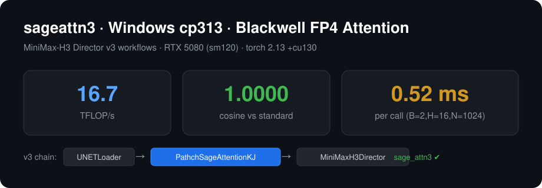

# sageattn3 cp313 Windows Wheel + MiniMax-H3 v3 加速

**社区首个可在 Windows + Python 3.13 + torch 2.13 (cu130) 上直接安装使用的 sageattn3 wheel**，以及配套的 MiniMax-H3 Director v3（sageattn3 FP4 加速）工作流。



## 亮点

- ✅ **cp313 / win_amd64 wheel**，torch 2.13.0+cu130 直接 `pip install` 可用（无需自己编译）
- ✅ 官方及 mengqin 的 Windows wheel 均为 torch 2.9 构建，与 torch 2.13 **ABI 不兼容**（报"找不到指定的程序"）——本仓库补齐了这个空白
- ✅ RTX 5080（sm120）实测：**16.7 TFLOP/s**，精度与标准 attention **完全一致**（余弦相似度 1.0，MSE = 0）
- ✅ 附 8 个 MiniMax-H3 **v3 加速工作流**（UNET attention 走 sageattn3 FP4 内核）
- ✅ 附**完整编译指南**（BUILD.md），任何人可复现

**硬件目标：** RTX 50 系（sm120，Blackwell），实测 RTX 5080 · **内核：** sageattn3 的 FP4 量化 Flash Attention（`sageattn3_blackwell`）

> 编译指南 [BUILD.md](BUILD.md) / [BUILD_zh.md](BUILD_zh.md)

---

## 文件结构

```
sageattn3-v3-release/
├── README.md                        # 英文版（概述 / 安装 / 发布说明）
├── README_zh.md                     # 本文件（中文）
├── BUILD.md                         # 从源码编译 wheel 的完整指南
├── BUILD_zh.md                      # 编译指南（中文）
├── LICENSE                          # Apache-2.0（与原项目一致）
├── requirements.txt                 # 运行时依赖钉版本（torch 2.13+cu130、sageattn3 1.0.0、comfyui-frontend-package 1.48.7 等）
├── .gitignore                       # 忽略 dist/（wheel 作为 Release asset 发布）
├── assets/
│   └── preview.svg                  # README 顶部横幅图
├── dist/
│   └── sageattn3-1.0.0-cp313-cp313-win_amd64.whl   # 成品 wheel（直接 pip 安装）
├── patches/
│   ├── api.cu                       # 修改后的 api.cu（已删除多余 include）
│   ├── api.cu.bak                   # 原始 api.cu（补丁基准）
│   └── api.cu.patch                 # 对应的 unified diff（仅删 1 行；git apply / patch -p1 均可用）
├── tools/
│   ├── setup.py                     # 编译配置（全 C++20，关键）
│   ├── build_env.py                 # 编译环境注入脚本（MSVC/SDK/CUDA 环境变量）
│   ├── make_v3_workflow.py          # v3 工作流转换（单文件版）
│   ├── make_v3_workflows.py         # v3 工作流批量转换（8 个示例全转）
│   └── install.ps1                  # 一键安装脚本（ComfyUI 便携版）
└── workflows_v3/
    ├── minimax_h3_director_加速版_v3.json
    ├── minimax_h3_director_t2v_v3.json          # 文生视频
    ├── minimax_h3_director_external_groups_i2v_v3.json  # 图生视频
    ├── minimax_h3_director_r2v_v3.json          # 参考图→视频
    ├── minimax_h3_director_external_groups_r2v_v3.json
    ├── minimax_h3_director_v2v_v3.json          # 视频→视频
    ├── minimax_h3_director_rv2v_v3.json         # 参考视频→视频
    └── minimax_h3_director_fl2v_v3.json         # FL 图生视频
```

## 模型准备（本仓库**不包含**，需自行下载）

MiniMax H3 模型文件**不属于本仓库**（许可与体积原因）。工作流引用了以下文件，请从 **MiniMax 官方渠道 / HuggingFace** 获取，并放到 `<ComfyUI>/models/` 对应目录：

| 文件 | 节点 | 放置目录 |
|---|---|---|
| `minimax_h3_fl2va_pruned_int8_convrot.safetensors` | UNETLoader | `models/checkpoints/`（或 `models/unet/`）|
| `minimax_h3_ref2va_pruned_int8_convrot.safetensors` | UNETLoader | `models/checkpoints/`（或 `models/unet/`）|
| `qwen3vl_32b_heretic_minimax_h3_nvfp4.safetensors` | CLIPLoader | `models/clip/` |
| `minimax_h3_audio_vae_fp32.safetensors` | VAELoader | `models/vae/` |
| `minimax_h3_video_vae_fp16.safetensors` | VAELoader | `models/vae/` |

如果你下载的模型文件名不同，改对应 loader 节点里的文件名即可。

## 快速开始（只用手册，不编译）

```bat
:: 1) 安装 wheel 到你的 ComfyUI 环境（python_embeded 也可）
D:\AI\ComfyUI\xxx\python_embeded\python.exe -m pip install dist\sageattn3-1.0.0-cp313-cp313-win_amd64.whl --force-reinstall

:: 2) 导入验证
D:\AI\ComfyUI\xxx\python_embeded\python.exe -c "import sageattn3; print('OK')"

:: 3) 把 workflows_v3\ 里的工作流复制到
::    <ComfyUI>/user/default/workflows/  然后打开 ComfyUI 直接使用
```

> **依赖说明：** 仓库附带钉版本的 `requirements.txt` 供参考。注意 `torch==2.13.0+cu130`、`sageattention==2.2.0+cu130...` 与 `sageattn3==1.0.0` **不在 PyPI 上**（CUDA 13.0 本地 / 自定义构建）。请先从 `dist/` 安装 wheel，再对剩余纯 PyPI 包执行 `python -m pip install -r requirements.txt`；若只装 wheel 也可直接跳过 `requirements.txt`。

v3 工作流原理：用 **KJNodes 的 `PathchSageAttentionKJ`**（参数 `sageattn3`）替换 H3 原生的 `MiniMaxH3MemoryEfficientSageAttentionPatch`，使 UNET 的 attention 走 sageattn3 的 FP4 内核：

```
UNETLoader → PathchSageAttentionKJ(sageattn3) → MiniMaxH3Director
```

## 为什么需要自己编译（社区空白）

sageattn3 官方与 mengqin 的 release 只提供 Linux wheel；mengqin 的 Windows wheel 是 `cu130torch291`（torch 2.9.1）构建，**与 torch 2.13 (cu130) ABI 不兼容**，直接装会报 `找不到指定的程序`。本仓库提供 **torch 2.13 可直接用的 cp313 wheel**，以及可复现的编译流程。

## 关键技术点（编译踩坑总结）

| 问题 | 原因 | 解决 |
|---|---|---|
| `error C3545`（MSVC）| CUTLASS v3.9.2+ 的 CuTe 模板在 C++20 下触发 MSVC bug | 见 BUILD.md：**删除 api.cu 中 `#include <torch/nn/functional.h>`**（它引入的 torch C++ API 头文件深度实例化 CuTe 模板才触发；删掉后 C++20 下不再出现） |
| `cudafe++ 崩溃 0xC0000409` | CUDA 13.3 的 nvcc 前端处理大模板文件时崩溃 | **使用 CUDA 13.1 工具链**（与 13.3 可并存） |
| `LNK1104: python313.lib` | ComfyUI python_embeded 精简版缺导入库 | 从任意 Python 3.13 安装目录复制 `python313.lib` 到 `python_embeded/libs/` |
| `Python.h` 缺失 | python_embeded 精简版无开发头文件 | 复制完整 Python 3.13 的 `include/` 到 `python_embeded/include/` |

## 实测数据（RTX 5080 / torch 2.13.0+cu130 / CUDA 13.1 编译）

| 指标 | 结果 |
|---|---|
| 输出 shape/dtype | `[2,16,512,128]` fp16 ✅ |
| 余弦相似度 vs 标准 attention | **1.0000** |
| MSE | **0.000000** |
| 速度 | **0.52 ms/次**（B=2,H=16,N=1024,D=128）|
| 算力 | **16.7 TFLOP/s** |

## 已知限制

- 仅支持 **sm120（RTX 50 系）**；RTX 40 系（sm89）不支持
- `ComfyUI/requirements.txt` 缺失会导致 `/system_stats` 返回 500（MiniMax 打包环境固有，不影响节点与工作流执行）
- 完整生成测试请自行在 ComfyUI 中运行（需加载 MiniMax H3 模型）

## 许可证

Apache-2.0 — 继承自 [mengqin/SageAttention](https://github.com/mengqin/SageAttention)。见 `LICENSE`。

## 免责声明

本发布为社区预编译 wheel，仅供方便使用，非 NVIDIA / SageAttention 官方发布。风险自负；若自行构建，请对照 `patches/` 中的源码补丁进行验证。

## 致谢

- [mengqin/SageAttention](https://github.com/mengqin/SageAttention)（sageattention3_blackwell 源码与 release）
- [ComfyUI-KJNodes](https://github.com/kijai/ComfyUI-KJNodes)（`PathchSageAttentionKJ` 节点）
- [AIMixer/ComfyUI_MiniMaxH3_Director](https://github.com/AIMixer/ComfyUI_MiniMaxH3_Director) — 8 个 v3 工作流派生自该节点自带的 `example_workflows/`（该节点基于 ComfyUI 官方 MiniMax H3 支持，PR #15224 / #15228）
- [NVIDIA/cutlass](https://github.com/NVIDIA/cutlass)（v4.0.0）
- [SageAttention](https://github.com/thu-ml/SageAttention) 团队
